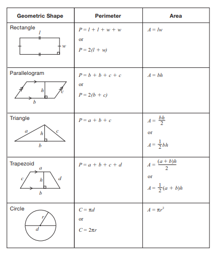

# Math Formulas
Here is a list of math formulas, hopefully it will be useful to you.
## Elementary
Pythagorean Theorem: a2 + b2 = c2
### Geometry
2D Shapes

## Secondary
### Geometry
3D Shapes

### Quadratics
### Trigonometry
Sine Law: 
Cosine Law: c2 = a2 + b2 - 4ab cosC

