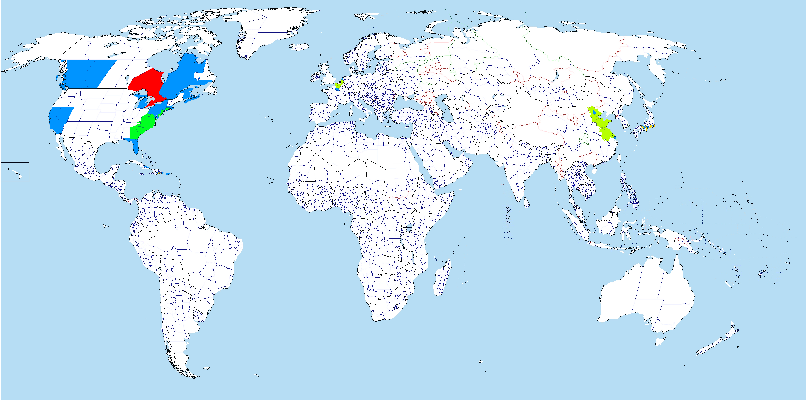

# Travel

I have visited a few places in the world. Here's a map.

Red = Ontario, where I reside.

Blue = Visited

Green = Transited through via car

Yellowish-Green = Transited through via train

Yellow = Transited through via bus

## Canada

### Ontario

### Quebec

### Alberta

### Atlantic Canada

## United States

### West

### East

## Caribbean

## Europe

## Asia
